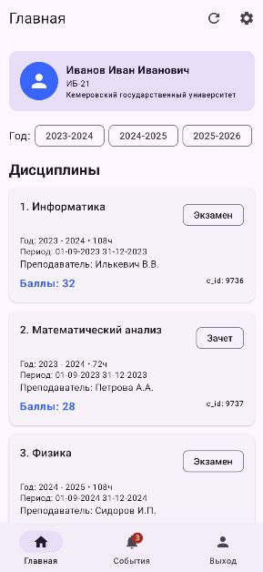
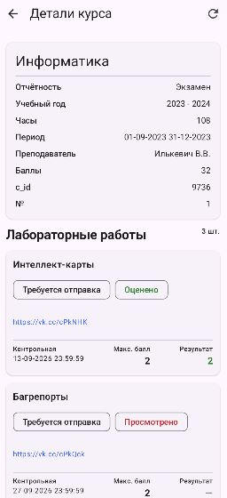
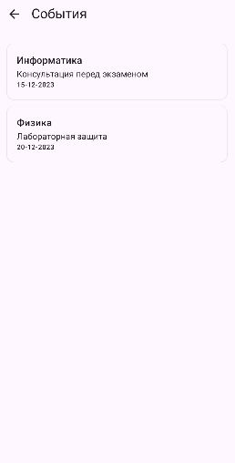
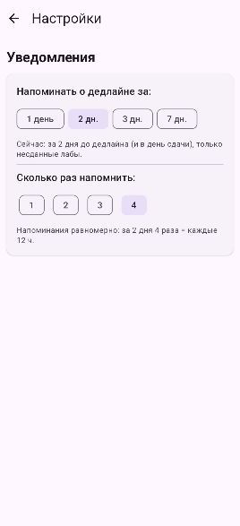
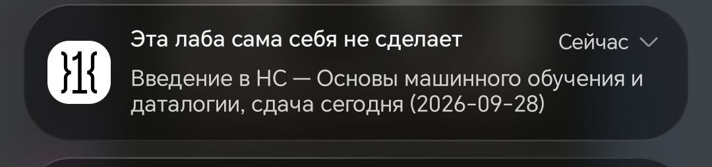

# КемГУ X

Неофициальное Android-приложение для студентов КемГУ: дисциплины, лабораторные работы, дедлайны и напоминания - всё из ЭИОС в одном месте.

> Проект учебный, скорее даже просто от нечего делать, никакого согласования с КемГУ не имеет. Все запросы идут напрямую к официальным серверам университета от имени вашего аккаунта.

---

## 📸 Скриншоты

| Главная | Детали курса | События                                 |
|---|---|-----------------------------------------|
|  |  |  |

| Настройки                                   | Уведомления                          |
|---------------------------------------------|--------------------------------------|
|  |  |

---

---

## ✨ Возможности

- **Вход через ЭИОС** - авторизация через `api-next.kemsu.ru` + bridge-сессия старого портала `xiais.kemsu.ru`.
- **Дисциплины** - весь список за все годы одним запросом (`studyYear=` пустой), фильтр по учебному году локально: сен–дек 2026 → `2026-2027`, янв–июл 2027 → тоже `2026-2027`.
- **Лабораторные работы** - задания каждого курса (`tasks_st.htm` по `c_id`) с названием, дедлайном, баллами/максимумом и статусом.
- **Кеш лаб** - задания хранятся в локальной базе: повторные заходы открываются мгновенно. Изменённые с прошлого захода лабы помечены чипсом «Обновлено».
- **Фильтр и цвета статусов** - `Все / Сданные (зелёные) / 0 баллов (красные) / На проверке (голубые) / Не сданные (жёлтые)`. «0 баллов» - это именно оценённая в ноль работа, а не «оценки пока нет».
- **Дедлайны и уведомления** - проход по лабам актуального года, события «дедлайн завтра/сегодня», уведомления со звуком и живыми заголовками («Эта лаба сама себя не сделает» 🙂).
- **Настройки напоминаний** - за сколько дней (1/2/3/7) и сколько раз (1/2/3/4): например, «за 2 дня 4 раза = каждые 12 ч». Работает и в фоне через WorkManager - без входа в аккаунт, по сохранённым данным.
- **Проверка обновлений** - сравнение версии с последним релизом на GitHub, баннер с кнопкой «Открыть на GitHub».
- **Полный выход** - отдельная кнопка на экране входа стирает базу, токены, куки и фоновые задачи.

---

## ⚠️ Известные проблемы

- **Просроченный SSL-сертификат `xiais.kemsu.ru`.** Приложение терпит *только* просрочку даты (цепочка и hostname проверяются как обычно). Когда вуз продлит сертификат, ничего менять не надо.
- **Неточные фоновые напоминания.** WorkManager не гарантирует точное время: в Doze/экономии батареи срабатывание может опоздать на часы. Это ограничение Android.
- **Наследие старого портала.** Сервер отдаёт `windows-1251` вперемешку с HTML-сущностями (`&#1047;...`), кнопка курса - это `<input type="image">`, поэтому в запрос шлются координаты клика `x/y`. Парсинг привязан к текущей вёрстке и может сломаться при редизайне ЭИОС.

---

## 📱 Требования к устройству

- Android 10 (API 29) и выше.
- Доступ в интернет без VPN (все данные - с серверов КемГУ, офлайна нет, кроме кеша).
- ~50 МБ свободного места (приложение + локальная база).
- Для напоминаний: разрешённые уведомления (запрос появляется при открытии главной) и желательно снять ограничение фоновой работы для приложения, иначе система будет откладывать напоминания.

---

## ❓ FAQ и рекомендации

**Q: Список дисциплин пуст / «Пустой список дисциплин (0)».**
A: Потяните вниз, чтобы обновить. Если не помогло - перезайдите (сессия могла протухнуть). Смотрите метку «Обновлено: …» под «Лабораторными» - она показывает, когда данные реально приходили.

**Q: Не приходят уведомления о дедлайнах.**
A: По порядку: 1) разрешены ли уведомления для приложения; 2) сняты ли ограничения фона/батареи; 3) открывалось ли приложение хотя бы раз после установки (иначе базе неоткуда взять лабы); 4) попадает ли дедлайн в окно из настроек (по умолчанию - за 1 день). Повторные напоминания идут по интервалу «окно / количество», а не при каждом открытии.

**Q: Лаба показана не в том предмете / дублируется.**
A: Такое бывает, если сервер отдал один `c_id` двум строкам таблицы. Приложение пишет предупреждение `DUP cId` в logcat и складывает дампы `cache/disciplines.html`, `cache/tasks_<cId>.html` - приложите их к issue.

**Q: Что делает «Выйти из аккаунта (стереть всё)»?**
A: Удаляет вообще всё локальное: дисциплины, лабы, события, пользователя, токены, куки и отменяет фоновые напоминания. Для повторного входа логин и пароль придётся ввести заново.

**Q: Баннер обновления не появляется, хотя релиз вышел.**
A: В `ApiConfig` должны быть заполнены `GITHUB_OWNER` и `GITHUB_REPO`. Без них проверка молча пропускается. Текущая версия всегда видна внизу главной.

**Q: Можно ли пользоваться без интернета?**
A: Частично: дисциплины и лабы последнего удачного обновления остаются в кеше и открываются мгновенно, но свежие данные и проверка дедлайнов требуют сети.

---